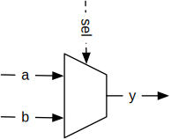
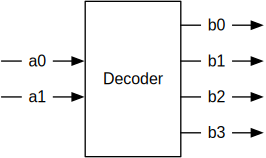

# Lab 2: Combinational Circuits in Chisel

The lab session will show you how to describe combinational circuits
with Chisel. You get modules, where you need to add the description of
combinational circuits. You will run unit tests to test your circuit.
Optional you can also synthesize your circuit for an FPGA and test it
with the FPGA board.

Having the tests before the implementation is called test driven
development and is common in software development, but it is also good practice
in hardware design. This time the tests are given to you, in a later lab session
you will write your own tests.

After the lab you will know how to use the few constructs to describe
common combinational building blocks, such as mulitplexer, encoder,
decoder, and function tables in Chisel.

We assume that you have downloaded the complete lab material from GitHub
and it is placed in folder ```chisel-lab```.

## Background Reading

 * This lab is loosely based on Chapter 2 and 5 of
*[Digital Design with Chisel](http://www.imm.dtu.dk/~masca/chisel-book.html)*

## Compiling and Testing of Combinational Circuits

Today's lab topic is to describe selected combinational building blocks in Chisel.
We provide the testing code for your circuits. You have completed all exercises
when all tests (run with ```sbt test```) complete without an error.

With IntelliJ import the lab2 project as follows:

 * Start IntelliJ
 * Click *Import Project*, or on a running IntelliJ: *File - New -
Project from Existing Source...*
 * Navigate to ```.../chisel-lab/lab2``` and select the file ```build.sbt```, press *Open*
 * Make sure to select a JDK 1.8 or later
 * Press OK on the next dialog box
 
### A Majority Voter

We start as first exercise with a relative simple circuit, a majority voter.

Navigate to the Chisel component ```Majority``` by following in the Project navigator along: *lab2 - src - main - scala - Majority*.
Open ```Majority``` with a double click.

This is a Chisel component that shall implement the majority voting of three
signals (```a```, ```b```, and ```c```). Majority voting means that the output of
the circuit is the majority of the inputs, e.g., if ```a==1```, ```b==0```, and
```c==1``` the result shall be ```1```. See Dally 3.6 for a solution in VHDL.
Your task is to implement that circuit in Chisel.


Open the terminal at the bottom of the IntelliJ window and run:
```
sbt test
```
to compile and test your project.

In the *Run* window you should see several tests failing, similar to:
```
[info] *** 4 TESTS FAILED ***
[error] Failed: Total 6, Failed 4, Errors 0, Passed 2
```

For the majority circuit we provide three *tests*:

 1. ```MajorityPrinter```: A test that simply prints the logic table of the
   circuit. This form of test is helpful for debugging, but not for
   automated regression tests.
 1. ```MajoritySimple```: A too simple test that covers only some cases
   and will succeed for the too simple default implementation. This shows
   you that testing can usually not guarantee a 100% correct solution.
 1. ```MajorityFull```: is an exhaustive tester that covers all possibilities.
   This is the best form of a tester. However, exhaustive testing is only
   possible for very simple circuits.
   
You run a single test with following command in the terminal window:

```
sbt "testOnly MajorityPrinter"
```

Run the ```MajorityPrinter``` and watch the printout of the logic table:

```
[info] [0.002] Logic table for Majority
[info] [0.002] a b c -> out
[info] [0.016] 0 0 0 -> 0
[info] [0.017] 1 0 0 -> 1
[info] [0.018] 0 1 0 -> 0
[info] [0.019] 1 1 0 -> 1
[info] [0.021] 0 0 1 -> 0
[info] [0.022] 1 0 1 -> 1
[info] [0.023] 0 1 1 -> 0
[info] [0.024] 1 1 1 -> 1
test Majority Success: 0 tests passed in 13 cycles taking 0.045750 seconds
[info] [0.025] RAN 8 CYCLES PASSED
```

This shows that the default implementation just copies the value of ```a```
to the output. Clearly not a majority circuit. Change the Majority component
to implement the majority circuit. You can watch the logic table for debugging.
However, at the end run:
```
sbt "testOnly MajorityFull"
```
to make sure you have completed this exercise.
   

### Optional: Generating Hardware

In lab1 you have learned how to generate hardware to run in an FPGA.
In the current lab exercise you use testing to run your combinational circuit.
However, we can also run those circuits on the FPGA board and use switches
and LEDs to test the circuits.

Generate the Verilog description by running the Majority App with:
```
sbt run
```
If there are more than one App in a project, you need to select which one
to run, the ```Majority```. Like the test cases, you can also directly
select which App to run by:
```
sbt "runMain Majority"
```

Create a Xiling Vivado project with the source file ```Majority.v``` and
the constraint file ```majority.xdc``` that includes the pin definitions.
Synthesize and implement the design, create the bitstream, configure the
FPGA, and test the device with the three switches ```sw0```, ```sw1```,
and ```sw2```.

Although testing in real hardware gives confidence that the design works
it has two drawbacks: (1) synthesizing, even a small design, consumes a
considerable amount of time and (2) it is manual.
With tests written in Chisel the testing is faster and easier to reproduce
and automate.

### A Multiplexer (Mux)



A multplexer selects between different input signals. In the above figure
it is a 2:1 multiplexer. With ```sel``` we route either input ```a``` or
input ```b``` to output ```y```. We assume in this example that ```a```
is slected when ```sel``` is ```0``` or ```false```, otherwise  ```b```.

Open the ```Mux2``` component to implement the multiplexer.
You can test your implementation with:
```
sbt "testOnly Mux2Spec"
```

A low-level solution would be to describe the multiplexing function
as Boolean equation, such as ```(!sel & a) | (sel & b)```.
This is correct (try it in ```Mux2```), but hard to read.
Furthermore, this equation does not work so easily with multi-bit
values.

A better solution is to conditional assignment, in Chisel
with ```when``` and ```.otherwise```.
Look it up in Chapter 5 of the Chisel book and implement the
Multiplexer.

As multiplexing is such a fundamental operation, that Chisel provides
provides a multiplexer component ```Mux```.
Implement you final version of a multiplexer by using the ```Mux```
component.

The *cool* thing on the ```Mux``` component is that it can multiplex
arbitrary complex data structures, not just a vector of bits.
Any user defined data type will work with ```Mux```.

### A Decoder



The next exercise is to describe a 2-bit decoder. The test is called
as follows:

```
sbt "testOnly DecoderSpec"
```

You can find the skeleton of the exercise in ```Decoder.scala```.
Fill in the missing statement(s). A Chisel ```switch``` statement is probably
the most elegant solution, but other solutions are valid as well.

### Addition/Subtraction Circuit

As a last exercise you have to build a small arithmetic circuit.
The circuit shall be able to add or subtract two unsigned integer.
One input (```selAdd```) decides if the two numbers are added or
subtracted (sounds like a multiplexer). The test is called as:

```
 sbt "testOnly AddSubSpec"
```

The file for your solution is ```AddSub```.

