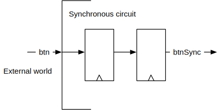

# Lab 3: Components and Small Sequential Circuits

The lab session will show you how to use components, called modules in Chisel,
and how to describe small sequential circuits.

We assume that you have downloaded the complete lab material from GitHub
and it is placed in folder ```chisel-lab```.

Similar to the first two labs you import the projects in IntelliJ.
We will not repeat these instructions here. See the former labs for the
instruction.

We provide the testing code for your circuits. You have completed all
(Chisel code) exercises when all tests (run with ```sbt test```) complete
without an error.

Have fun!

## Background Reading

 * This lab is loosely based on Chapter 2, 4, and 6 of
*[Digital Design with Chisel](http://www.imm.dtu.dk/~masca/chisel-book.html)*

   
## Using Components

The following two exercises teach you how to create and use components/moduls.

### Use the Mux2

We provide a ```Mux2``` component, a 2:1 multiplexer with single-bit inputs.
For the first exercise edit ```UseMux2```. There you shall create an instance of
```Mux2``` and connect it to the signals: ```a```, ```b```, ```sel```, and ```res```.
Run the specific test for this exercise with:

```
 sbt "testOnly UseMux2Spec"
```
 
### Design a 4:1 Multiplexer

In digital design we often build larger, more complex designs by combining
smaller and simpler components. In this exercise you shall build a 4:1 multiplexer
out of 2:1 multiplexers (the ```Mux2``` component.) The ```Mux4``` component has
a 2-bit select input (```sel```), four inputs (```a```, ```b```, ```c```, and ```d```),
and one output (```y```). Select ```a``` when ```sel``` is ```"b00"```,
```b``` when ```sel``` is ```"b01"```, and so on.

Before writing Chisel code draw the solution on a sheet of paper and discuss the solution.
When you are confident in your design (done on paper), code it up in Chisel in ```Mux4```.
Run the test for the 4:1 multiplexer with:

```
sbt "testOnly Mux4Spec"
```

## Small Sequential Circuits

The next four exercise teach you to create and use registers to build
sequential circuits.

### Build a Two Clock Cycles Delay

The next exercise is a simple circuit containing two registers that form a 2 clock
cycles delay. This circuit is also used as an input synchronizer for external asynchronous
signals. Below you find the schematics of this circuit.



Implement the two clock cycle delay in ```Delay``` and run the test for the two clock cycles
delay with:

```
sbt "testOnly DelaySpec"
```

### A Free Running Counter

Implement a 4-bit free running counter. That means the counter counts from 0 up to
15 and then restarts at 0. Put your implementation into ```Count15``` and run the
test with:

```
sbt "testOnly Count15Spec"
```

### Counter with a Limit

The next counter shall count up till 6 and then restart at 0.
Put your implementation into ```Count6``` and run the
test with:

```
sbt "testOnly Count6Spec"
```

### An Accumulator

As the last exercise on small sequential circuits implement an accumulator (register).
The accumulator addes the number provided in ```din```. It can be reset to 0 by
asserting ```setZero```. The accumulator shall be set to 0 on reset.
Implement the accumulator in ```Accu``` and test it with:

```
sbt "testOnly AccuSpec"
```

## Schematic from Chisel Code

We have several different ways to specify digital circuits. We can draw block
diagrams as a visual representation or write Chisel code for simulation and
synthesis of the circuit. It is important to be able to translate between those
spcifications. In this part of the exercise you get Chisel code and shall draw
a schematic of the circuit. Discuss your schematic with a TA.

### Code Example 1

```
  when(ok) {
    ligth := GREEN
  } .otherwise {
    light := RED
  }
```

### Code Example 2

```
  val dout = WireDefault(0.U)

  switch(sel) {
    is(0.U) { dout := 0.U }
    is(1.U) { dout := 11.U }
    is(2.U) { dout := 22.U }
    is(3.U) { dout := 33.U }
    is(4.U) { dout := 44.U }
    is(5.U) { dout := 55.U }
  }

```

### Code Example 3

```
  val regAcc = RegInit(0.U(8.W))

  switch(sel) {
    is(0.U) { regAcc := regAcc}
    is(1.U) { regAcc := 0.U}
    is(2.U) { regAcc := regAcc + din}
    is(3.U) { regAcc := regAcc - din}
  }
```

## An App to Generate Verilog (Optional)

This is an optional exercise, if you run out of work during the lab ;-)

 * Write an App to generate Verilog for the Mux4 circuit
 (an object that extends App, in ```Mux4.scala```)
 * Adapt the .xdc file for the circuit
 (e.g., start from the Basis .xdc file in the root of the lab folders)
 * Generate a Vivdao project
 * Synthesize
 * Configure the FPGA
 * Test the Mux4 in the FPGA with the switches and one LED

