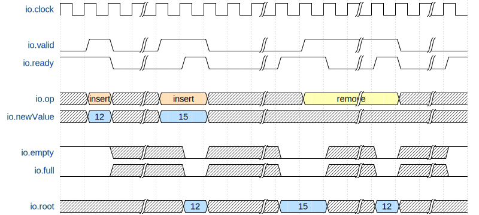

# Lab 4: Testing

## Background Reading

 * Chapter 3 of
*[Digital Design with Chisel](http://www.imm.dtu.dk/~masca/chisel-book.html)*

## Use IntelliJ

With IntelliJ import the lab project as follows:

 * Start IntelliJ
 * Click *Import Project*, or on a running IntelliJ: *File - New -
Project from Existing Source...*
 * Navigate to ```.../lab4``` and select the file ```build.sbt```, press *Open*
 * Press OK on the next dialog box


## Mux5 

In this part you shall write test code for a 5:1 multiplexer. The interface
of the multiplexer is:

```scala
class Mux5 extends Module {
  val io = IO(new Bundle {
    val a = Input(UInt(8.W))
    val b = Input(UInt(8.W))
    val c = Input(UInt(8.W))
    val d = Input(UInt(8.W))
    val e = Input(UInt(8.W))
    val sel = Input(UInt(3.W))
    val y = Output(UInt(8.W))
  })
  .....
}
```

Write the test code for the ```Mux5``` implementation. Try **not** to
look into the implementation. The implementation has errors.
Your job is to show those errors with your test code. You do not
need to correct the errors in ```Mux5```.

 * There is a *starting* code given in ```src/test/scala```.
 * Use ChiselTest and edit the code
   in ```src/test/scala```, and run your test with ```sbt test```.
 * The empty test will pass, however, you need to do a test that shows
   that there is an error. Your test shall fail at the end.
 * Try to find out what the error is just with your testing, not showing
   into the DUT.

## Heap

In this part you will write test code for a component which should determine the largest number in a sequence of numbers. 

The component supports two operations to interact with the sequence of numbers which is stored internally in the component. On the one hand, a single new number can be inserted into the sequence. On the other hand, the largest number of the sequence can be removed. 


The interface of the component is:
```scala
val io = IO(new Bundle {
  val op = Input(Heap.Operation())
  val newValue = Input(UInt(8.W))
  val root = Output(UInt(8.W))
  val empty = Output(Bool())
  val full = Output(Bool())
  val valid = Input(Bool())
  val ready = Output(Bool())
})
```

The capacity of the component is limited to fit 8 numbers in the internal sequence. The empty and full flags are used to signal that none or 8 numbers are in the sequence, respectively.

The ready and valid flags are used to coordinate communication between the component and the outside world. When the component is not busy, it asserts `io.ready` and all output signals are considered stable. 

When the outside world wants to issue an operation, it asserts `io.valid` and indicates the type of operation at the same time on `io.op`. If the operation is an insertion, the new number is provided on `io.newValue` which is 8-bit wide.

The operation is started after `io.valid` and `io.ready` are both asserted in the same clock cycle. The operation is finished when `io.ready` is asserted again and the results of the operation can be observed on the outputs of the component.

The following timing diagram visualizes the issuing of operations using the ready-valid interface.



The operation types are referred to using `Operation.Insert` and `Operation.RemoveRoot` in Chisel. In the test code, you can simply apply these when poking `io.op`:

```scala
dut.io.op.poke(Operation.Insert)
```

You can now write test code to verify the correct behavior of the component. More specifically check that the following statements hold:

* The dut asserts empty after all numbers have been removed
* The dut asserts full when 8 numbers have been inserted
* Inserting new values when the dut asserts full does not change the internal sequence
* The dut deasserts full after a remove operation has finished on a previously full dut
* A non-empty dut always presents the currently largest number in the sequence on `io.root` when `io.ready` is asserted


