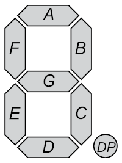
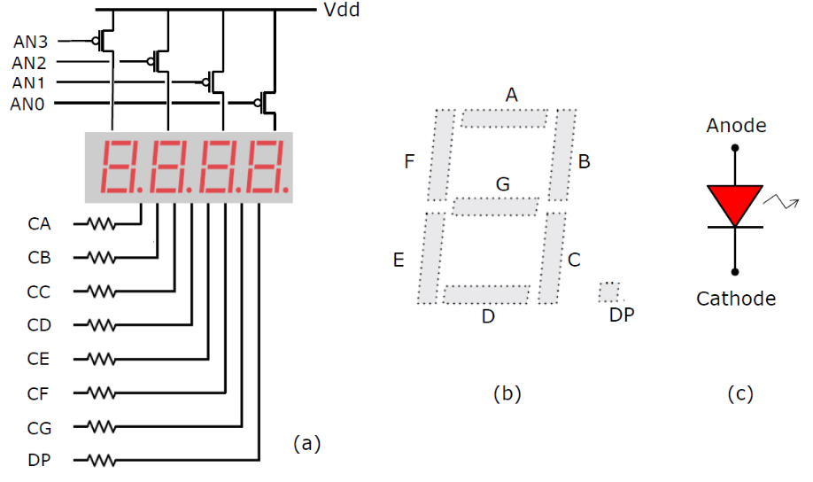
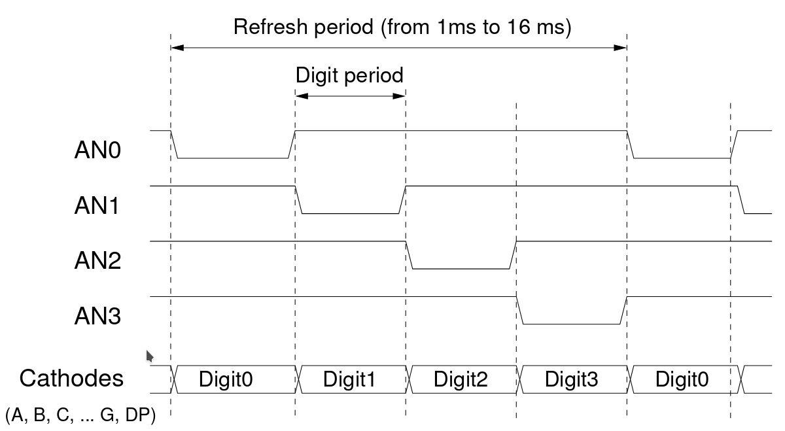

# Driving the 7-segment display

In this notebook, you will learn how to drive the 7-segment display. In order to do this, you will use counters, multiplexers and an input to the display. You will also use a look up table, which converts from the binary value into the 7-segment representation.


## Table of Content
* [1a: Hexadecimal to Seven-Segment Display](#1a:-Hexadecimal-to-Seven-Segment-Display)
* [1b: Test Drive the Seven-Segment Display](#1b:-Test-Drive-the-Seven-Segment-Display)
* [2: Multiplexed Seven-Segment Display](#2:-Multiplexed-Seven-Segment-Display)
* [3: Complete Vending Machine](#3:-Complete-Vending-Machine)
* [4: Extra](#4:-Extra)
* [5: Top Level Module](#5:-Top-Level-Module)


# Setting up the environment
Import the Chisel modules


```scala
import chisel3._
import chisel3.util._
import chisel3.iotesters.{ChiselFlatSpec, Driver, PeekPokeTester}
```

<a id='HexTo7seg'></a>
# 1a: Hexadecimal to Seven-Segment Display

The first part is to make a 7-segment decoder, which takes a four bit binary value (0-15) and displays them on a 7-segment display on the basys board.





To show a 0, we would turn on all segments, except G (and the decimal point, DP).

Complete the following table, indicating what segments should be lit when showing which number ((Unintuitively) the 7-segment display on the Basys 3 board uses logic 0 to indicate the LED being lit):
```
╔════╦═══╦═══╦═══╦═══╦═══╦═══╦═══╗
║    ║ A ║ B ║ C ║ D ║ E ║ F ║ G ║
╠════╬═══╬═══╬═══╬═══╬═══╬═══╬═══╣
║ 0  ║ 0 ║ 0 ║ 0 ║ 0 ║ 0 ║ 0 ║ 1 ║
╠════╬═══╬═══╬═══╬═══╬═══╬═══╬═══╣
║ 1  ║   ║   ║   ║   ║   ║   ║   ║
╠════╬═══╬═══╬═══╬═══╬═══╬═══╬═══╣
║ 2  ║   ║   ║   ║   ║   ║   ║   ║
╠════╬═══╬═══╬═══╬═══╬═══╬═══╬═══╣
║ 3  ║   ║   ║   ║   ║   ║   ║   ║
╠════╬═══╬═══╬═══╬═══╬═══╬═══╬═══╣
║ 4  ║   ║   ║   ║   ║   ║   ║   ║
╠════╬═══╬═══╬═══╬═══╬═══╬═══╬═══╣
║ 5  ║   ║   ║   ║   ║   ║   ║   ║
╠════╬═══╬═══╬═══╬═══╬═══╬═══╬═══╣
║ 6  ║   ║   ║   ║   ║   ║   ║   ║
╠════╬═══╬═══╬═══╬═══╬═══╬═══╬═══╣
║ 7  ║   ║   ║   ║   ║   ║   ║   ║
╠════╬═══╬═══╬═══╬═══╬═══╬═══╬═══╣
║ 8  ║   ║   ║   ║   ║   ║   ║   ║
╠════╬═══╬═══╬═══╬═══╬═══╬═══╬═══╣
║ 9  ║   ║   ║   ║   ║   ║   ║   ║
╠════╬═══╬═══╬═══╬═══╬═══╬═══╬═══╣
║ 10 ║   ║   ║   ║   ║   ║   ║   ║
╠════╬═══╬═══╬═══╬═══╬═══╬═══╬═══╣
║ 11 ║   ║   ║   ║   ║   ║   ║   ║
╠════╬═══╬═══╬═══╬═══╬═══╬═══╬═══╣
║ 12 ║   ║   ║   ║   ║   ║   ║   ║
╠════╬═══╬═══╬═══╬═══╬═══╬═══╬═══╣
║ 13 ║   ║   ║   ║   ║   ║   ║   ║
╠════╬═══╬═══╬═══╬═══╬═══╬═══╬═══╣
║ 14 ║   ║   ║   ║   ║   ║   ║   ║
╠════╬═══╬═══╬═══╬═══╬═══╬═══╬═══╣
║ 15 ║   ║   ║   ║   ║   ║   ║   ║
╚════╩═══╩═══╩═══╩═══╩═══╩═══╩═══╝
```
You now have what looks an awful lot like a truth table for several outputs.

The next point is to define the decoder. We have given you the module definition. You need to fill out the code to generate the look up table. Remember to connect the output. Do you get an error? Try the [FAQ](https://github.com/schoeberl/chisel-intro-de2/blob/master/FAQ.md).


```scala
class SevenSegDecoder() extends Module {
    
    val io = IO(new Bundle {
        val in = Input(UInt(4.W))
        val out = Output(Bits(7.W))
    })
    
    
    //Make an output wire
    
    
    //Connect this wire to different values, depending on the input
    
    
    //Don't forget to connect the output of the module
    io.out := "b1010101".U //dummy output
}
```

## Testing the output

Below we have made a PeekPokeTester for you. This example takes a module called SevenSegDecoder and applies the binary values from 0 to 15. This is done using the poke method. The function, print7Segment may seem daunting, but you do not have to know how it works. What it does is simply to print 4 lines, the first being the hexadecimal representation and the next three lines are printing either "_" or "|" depending on whether the bit for these are turned on.

To test this, run the following command:

    $ sbt "runMain SevenSegmentDriver"

For the number 8, you would expect to see
<pre>
 _
|_|
|_|

</pre>


```scala
def print7Segment(x:BigInt,y: Int){
    println(y.toHexString)                       //Print the hexadecimal value
    println(if ((x & 0x40) == 0) " _"  else " ") //Print top "_"
    print(if((x & 0x2) == 0) "|" else " ")       //Print top left "|"
    print(if((x & 0x1) == 0) "_" else " ")       //Print middle "_"
    println(if((x & 0x20) == 0) "|" else " ")    //Print top right "|"
    print(if((x & 0x4) == 0) "|" else " ")       //Print lower left "|"
    print(if((x & 0x8) == 0) "_" else " ")       //Print lower "_"
    println(if((x & 0x10) == 0) "|" else " ")    //Print lower right "|"
    println()                                    //Print empty line
}

Driver.execute(Array(),() => new SevenSegDecoder()) {
  c => new PeekPokeTester(c) {
      
    for (value <- 0 until 16) {
        poke(c.io.in, value) //We apply a value to the input
        println(peek(c.io.out).toString(2).reverse.padTo(7,'0').reverse) //And check the value on the output.
        print7Segment(peek(c.io.out),value) //Here we print the result, as it would look on the 7-segment display.
    }
  }
}
```

# Implement onto the Basys board
We can now test out the 7-segment display on the board, to verify that everything works as expected.

The figure below shows how the hardware is made on the Basys 3 board. *(a)* shows how the power goes through a p-type Mosfet or p-type transistor. Refer to [Basys 3 reference manual](https://reference.digilentinc.com/reference/programmable-logic/basys-3/reference-manual#basic_io) in case you are in doubt. Notice that the power comes from *Vdd* and goes through the mosfet on to the segments. Assuming that the mosfet connected to AN3 is conducting, what will need to be applied to *CA* to make the *A* segment lit?




[At the bottom of this document](#top) you will find a top module for the vending machine. Read the description and add your seven segment decoder to this, have the Verilog generated, implement it using Vivado and verify that it works as expected.

Use the switches to drive the decoder and output the decoder to the segments.

Did the output look as expected when counting on the switches? Refer to the [FAQ](https://github.com/schoeberl/chisel-intro-de2/blob/master/FAQ.md) if any issues.

<a id='testHex'></a>
# 1b: Test Drive the Seven-Segment Display

The next goal is to make a counter for the 7-segment display, so we do not have to set the switches. There are two goals in this.
* We need to count from 0 to 15 (2^4 - 1)
* We need to increment with a frequency of i.e. 1 Hz


## Tick based counter
When doing a counter, we would like it to count at a reasonable frequency, such as once a second. Implement a counter class which outputs a 4 bit counter at a reasonable rate. If in doubt, refer to [Digital Design with Chisel, Chapter 6, section 2](https://github.com/schoeberl/chisel-book/wiki/chisel-book.pdf). ***Remember to draw your circuit before describing it in Chisel***

**Hint** You need to have a counter that generates the tick for the other counter. Basys3 has a clock frequency of 100MHz


```scala
class Counter() extends Module {
    val io = IO(new Bundle {
        val out = Output(UInt(4.W)) //The counter has 4 bits of output.
    })
    
    
    //Describe the counter
    
    
    //And don't forget to connect the output
    io.out := 0.U
}

```

You may want to test that your counter actually counts as expected. Try and generate a counter which counts up every tenth cycle. You can then use the below tester to verify the result (Running 100,000,000 cycles to check that it changes every second is quite slow). You would expect that the same number is shown 10 times and is then incremented once.


```scala
val testResult = Driver.execute(Array(),() => new Counter()) {
  c => new PeekPokeTester(c) {
      
    for (value <- 0 until 50) { //We check 50 times.
        println(peek(c.io.out).toString ) //Print the value on the output.
        step(1) //Move 1 clock cycle ahead.
    }
  }
}
```

# Generate the code

Extend the top module at the bottom, so that it uses a counter instead of the switches. You can either use the counter module you wrote or you can describe the counter directly.


## Which way is the best way? 
*It depends!*

When working in larger projects, it is usually nice to have different modules to get a better overview. This also allows for testing the different modules. However, if you make too many modules, it can be harder to understand what is happening when reading the code. 

As a rule of thumb, if you need to have multiple pieces of the same hardware, it makes sense to make a module. This way, if you need to change these modules, you only need to change them in one place.

If there is more boiler plate code than actual code in your module, you would probably be better off to just write the hardware directly.

<a id='muxHex'></a>
# 2: Multiplexed Seven-Segment Display
You now have a 7-segment decoder and a counter that can drive the 7-segment display. But as you must have noticed, all the segments showed the same. This is because the display uses the same 7 wires for all the segments. However, you can control which set of segments are lit by setting the AN signal. Digilent, who made the Basys board, has an excellent overview of how the 7-segment display works, in their [Basys 3 reference manual](https://reference.digilentinc.com/reference/programmable-logic/basys-3/reference-manual#basic_io). Read the section about the 7-segment display with a focus on the multiplexing part.



When showing an output on one 7-segment display, you can show the numbers from 0 to 15. When using all four displays, you can show 4 numbers from 0 to 15 for a total of 65536 numbers.

In the vending machine, you will be showing one value on the two leftmost displays and another value on the two rightmost displays. Sketch how you would perform this, given two 8 bit numbers time-multiplexed onto the 7-segment display, using the 7-segment decoder.

**Hint** Multiplexers are a great way of choosing between data

**Hint** Counters are a great way of counting to 4, which coincides with the number of displays that needs to be turned on.

## Performing Multiplexing
Implement the time-multiplexing as you have drawn it on the paper. You need to change the display with a frequency of more than 240 Hz but less than 1 KHz. Remember that the clock frequency of the Basys 3 board is 100 MHz.

Add the code to the top level module in the bottom. You can either write it directly or you can make a module for it. This is up to you, the designer!

# Optional

You now have a 7-segment display showing a hexadecimal number. This can be difficult to interpret at a glance. What number is CA? Therefore, we can do a Binary-Coded Decimal (BCD) representation by encoding the value we wish to output. How many bits can you represent with two decimal numbers?

The following module generates a big look-up table that encodes N bits into an M bit BCD number. Connect this before the number you would like to show. ***Remember to draw the hardware before you describe it in Chisel!***


```scala
class BCDTable() extends Module {
    val io = IO(new Bundle {
        val address = Input(UInt(8.W))
        val data = Output(UInt(8.W))
    })
    
    val lookup = new Array[Int](256)
    
    
    for (i <- 0 until 99){
        lookup(i) = ((i/10)<<4) + i % 10
    }
    
    val table = VecInit(lookup.map(_.U(8.W)))
    
    io.data := table(io.address)
}
```

<a id='Complete'></a>
# 3: Complete Vending Machine
In this final part, you will implement the rest of the vending machine.

## Design
The first step is to design a datapath. To do this you need to determine what data you need to store and manipulate.  This defines the registers in the datapath. By data we mean variables and not constants. Constants in hardware is just a matter of connecting signals to Vdd and Ground. Then you determine what operations you need to perform on the data. An operation is performed during a clock cycle and some example operations are *sum <= sum + 5* or *sum <= sum - price*. List all the operations that your datapath should be capable of performing. Based on this list of clock-cycle operations and the list of registers you should be able to design a datapath. There is a lot of freedom and many alternatives. In our case it should suffice to be able to do one single arithmetic operation in a clock cycle, i.e., to use only one single adder/subtractor in the datapath. When the datapath is in place, the next step is to design the finite state machine that will control the sequence of operations in the datapath and deliver the output signals *release_can* and *alarm*.
In summary, the design phase involves the following:

* A list of registers and “clock cycle operations” to be supported by the datapath
* A diagram showing an intended datapath design (registers, multiplexers, adders/subtractors etc.)
* A complete ASM-chart specification of the central processing unit or a state-graph of the FSM.
* A test sequence for simulating your design (a timing diagram and/or a Chisel PeekPokeTester).

A comment about the input signals: You should be aware of the fact that the signals will be asserted for as many clock cycles as you push the buttons and switches. For *reset* and *buy* this is what you want and need to deal with. For signals *coin2* and *coin5* you do not want to add *2 kr.* or *5 kr.* for as many cycles as you push the corresponding button. To avoid this the FSM in your *vending_machine_cpu* must respond to the rising edge and wait for the corresponding signal to be de-asserted

## Implementation

You should now describe your *vending_machine_cpu* in Chisel. You can either do this in a new module or extend the top module in the bottom. You should keep the state machine and data path seperated. This makes it easier to work on and debug.

It is very difficult to find errors in a state machine, it is suggested that you use the PeekPokeTester and generate a waveform for inspection.

* Write the Chisel code according to the specifications
* Write a test using the PeekPokeTester to drive the simulation
* Simulate the circuit and inspect the generated waveform

When this is done, you can connect everything in the top module. Generate the Verilog file, synthesize it in Vivado and upload to the Basys 3 FPGA-board. Try the solution and verify that it is working as expected and **show your design to a TA.**

## Evaluation
Assess the resource usage for the *vending_machine_cpu*. Check the resource usage reported by Xilinx Vivado. How many LUTs and FFs are used? Compare the RTL schematics with your hand designed data path. Is it as expected?


```scala
//For implementing the FSMD and PeekPokeTester
class FSM extends Module {
  val io = IO(new Bundle {
    //Define any inputs/outputs needed
  })
    
    
  //Define the FSM and datapath

}


Driver.execute(Array("--generate-vcd-output","on", "-tn", "FSM","--target-dir", "generated"),() => new FSM()) {
  c => new PeekPokeTester(c) {
      
  }
}
```

<a id='extra'></a>
# 4: Extra
Now that you have a functional vending machine, you should extend the project to include an extra feature. The following are suggestions but you can come up with your own extensions. **The “standard solution” without any optional tasks is considered a “standard performance”. To obtain a top grade (i.e., 12) you are expected to do something optional.**

* Display price and sum as decimal numbers making the machine less nerdy
* Supplement the alarm by visual signal, for example blinking the sum display
* Count coins and assert alarm if a coin compartment is full (>20 of given type ).
* Implement a digital debouncer circuit. This will allow you to use the push buttons on the Basys 3 board itself (instead of the external Pmod BTN pushbutton module).
* Include a can counter, that keeps track of how many cans are available
    * When out of cans, display something on the 7-segment displays (Epty)
    * Include a way of filling in more cans
* Add more cans
    * Different cans could have different prices and different storages
    * With different price, you could add a way of updating the price
    * You should be able to choose which can to use.
    
**REMEMBER to draw the circuit you want to make!**


```scala
//This cell can be used to define new modules
//Otherwise, implement it directly in the top module.

```

<a id='top'></a>
# 5: Top Level Module

All this does is describe a top module, from which you can bind inputs and outputs on the basys board, which is consistent with the XDC file given.

In this file, you should instantiate the different modules you have made and connect them to the inputs and outputs. Add one step at a time and verify that it is working. [FAQ](https://github.com/schoeberl/chisel-intro-de2/blob/master/FAQ.md)


```scala
/**
 * A top level to wire FPGA buttons, LEDs and 7-segment controllers
 * to the Basys3 board input and output.
 */
class VendingMachineTop extends Module {
  val io = IO(new Bundle {
    val sw = Input(UInt(16.W)) //16 switches
    val led = Output(UInt(16.W)) //16 LEDs
      
    val seg = Output(Bits(7.W))
    val seg_an = Output(Bits(4.W))
      
    val up = Input(Bits(1.W)) //These 4 signals are meant for the 4 push-buttons (T18) 
    val down = Input(Bits(1.W)) //(U17)
    val left = Input(Bits(1.W)) //(W19)
    val right = Input(Bits(1.W)) //(T17)
  })

    
  //Instantiate the SevenSegDecoder module
    
    
    
  //And other hardware as needed in the next steps
    
    
  //And don't forget to connect the outputs
  io.led := 42.U
  io.seg := 42.U
  io.seg_an := "b0101".U
}


// Generate a waveform based on inputs/outputs
Driver.execute(Array("--generate-vcd-output","on", "-tn", "VendingMachineTop","--target-dir", "generated"),() => new VendingMachineTop()) {
  c => new PeekPokeTester(c) {
      step(1)
  }
}

// Generate the Verilog code by invoking the Driver
val result = (chisel3.Driver.execute(Array("--target-dir", "generated", "-tn", "vending_machine"), 
                                     () => new VendingMachineTop()))
```

Generate the files using this command:

    $ sbt "runMain SevenSegmentDriver"

## Using Vivado
You now have the file generated in the *generated* folder. Now, follow the [Vivado guide](Vivado/install.ipynb) to make it run
