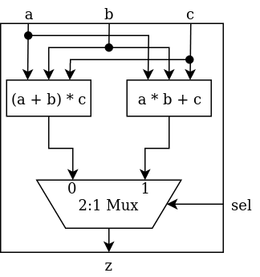

# Basics of combinatorial circuits using Chisel3 

In this notebook you will get introduced to the basics of Chisel. This will include 
- Modules
 - IOs  
- Chisel types/literals and operators
 - UInt, SInt, Bool.
 - +, -, ===, etc.
- Wires
- Multiplexers
- Registers


## Module and IO
The first Chisel keyword to be introduced is *Module* and *IO*.  
When declaring a class extending Module, it means that this code will be mapped to a Verilog module. Verilog modules are equivalent to components in VHDL. You start a Module description by declaring the inputs and outputs of the module. This is done using the special keyword *IO*. Declaring IO is equivalent to declaring the entity of a component in VHDL. All signals declared in IO must be specified as either an input or an output, this is done by wrapping the signals in the Input() and Output() apply methods (see code below). The IO declared in the empty module *HardwareModule* has signals from the three basic chisel data types; UInt (Unsigned Integer), SInt (Signed Integer) and Bool (boolean). You specify the width of the signal bus explicitly using the X.W with X being an integer larger than 0. You cannot set the width of a Bool as it represents a single wire. If you need a bus and don't interpret it as an integer use UInt anyway. Inspect the code below. 

```scala
class HardwareModule extends Module {   // Declare a class extending Module to declare the equivalent of a VHDL component
    val io = IO(new Bundle {            // Declare in- and outputs of the module. Equivalent to an entity declaration in VHDL - by convention named "io"
        val input1 = Input(UInt(8.W))   // Declaration of input as a 8-bit bus that can be interpreted as an unsigned integer.
        val input2 = Input(SInt(16.W))  // Declaration of input as a 16-bit bus that can be interpreted as a signed integer.
        
        val output1 = Output(UInt(8.W)) // Declaration of output as a 8-bit bus that can be interpreted as an unsigned integer.
        val output2 = Output(Bool())    // Declaration of output signal. Bool is a single wire that can either be 0 or 1.
    })
}
```

### Body of modules
In the body of the module, we describe the circuit of the module. This is equivalent to the architecture declaration in VHDL. We introduce this by making a module that takes three inputs a, b and c and produces the output z = (a + b) * c. This will be described in two steps, to introduce declaration of wires internal to a module, and signal value assignment. wires are declared using Wire(). See code below and read the comments. 

```scala
class AddMult extends Module {
    val io = IO(new Bundle {
        val a = Input(SInt(32.W))
        val b = Input(SInt(32.W))
        val c = Input(SInt(32.W))
        
        val z = Output(SInt(32.W))
    })
    
    val sum = Wire(SInt(32.W))     
    // sum is declared as an internal wire of the SInt type, is a bus that is 32-bits wide.
    val product = Wire(SInt(32.W)) 
    
    sum := io.a + io.b 
    // The line above is an assignment "sum" with the addition of inputs a and b. Assignments are 
    // written with ":=". Notice that the inputs are referred to by the prefix "io." which correspond 
    // to the name of the IO of this module. Remember that we are describing hardware, which means 
    // every assignment is evaluated concurrently. This means that you can only assign one value to a
    // wire, otherwise you are describing a short circuit.
    product := sum * io.c // note: a multiplier is a really big circuit
    io.z := product
}
```

## Instantiating Modules

For larger projects it is nice to divide the project into multiple modules. Then instantiate and connect the modules in a *top* module. Another reason to divide your projects into multiple modules is if you need multiple copies of the same hardware. In the code below, you can see how modules are instantiated and connected.

```scala
class UseModules extends Module {
    val io = IO(new Bundle {
        val a1 = Input(SInt(32.W))
        val a2 = Input(SInt(32.W))
        val b1 = Input(SInt(32.W))
        val b2 = Input(SInt(32.W))
        val c1 = Input(SInt(32.W))
        val c2 = Input(SInt(32.W))
        
        val z1 = Output(SInt(32.W))
        val z2 = Output(SInt(32.W))
    })
    
    val firstMultAdd  = Module(new AddMult()) // Instatiate the modules Using the Module method.
    val secondMultAdd = Module(new AddMult()) // There are now two individual AddMult units in our design.
                                              // We access them through the names we have given them.
    
    firstMultAdd.io.a  := io.a1 // Here we connect the inputs of this module, UseModules, to the inputs of one of
    firstMultAdd.io.b  := io.b1 // the AddMult instances 
    firstMultAdd.io.c  := io.c1
    
    secondMultAdd.io.a := io.a2 // Connecting inputs of the other instance
    secondMultAdd.io.b := io.b2
    secondMultAdd.io.c := io.c2
    
    io.z1 := firstMultAdd.io.z  // Connecting outputs of the the two instances to this module outputs.
    io.z2 := secondMultAdd.io.z // Instances of modules doesn't have to be connected. They can be connected to any 
                                // signal with the same type.    
}
```

## Operators
Operators such as + and * looks identical for scala and chisel. They are interpreded as hardware if the operand are Chisel types, which is the case for the operators used in the code above. All operands that are an assignment must be Chisel types. If you need a static value as operand for an operator a postfix is used:

```scala
42.U    // .U specifies the Chisel type UInt
42.S    // .S specifies the Chisel type SInt
true.B  // .B specifies the Chisel type Bool

val a = 42 + 42     // OK - Scala Addition
val b = 42.U + 42.U // OK - Chisel adder unit of adding two static signals.
val c = 42 + 42.U   // Not Cool! - You can't mix scala and chisel types in arithmetic expressions
```

For a list of all Chisel operators please see the official [Chisel3 Cheatsheet](https://www.chisel-lang.org/doc/chisel-cheatsheet3.pdf/)


## Multiplexers
A simple 2:1 multiplexer can be described using the Chisel method y := Mux(sel, a, b). here y = a if sel = true.B y = b otherwise. For larger multiplexers multiple 2:1 multiplexers can be used, this is not very elegant. Instead, larger multiplexers are inferred by the use of *switch* or *when* statements. The code below shows how to use each of these methods:

```scala
class AddMult extends Module {
    val io = IO(new Bundle {
        val sel1 = Input(Bool())     // Single wire input to be used as selector for 2:1 Multiplexer
        val sel2 = Input(UInt(2.W))  // 2-bit bus to be used as selector signal for 4:1 multiplexer
        
        val out1 = Output(UInt(8.W)) // Output for 2:1 Mux
        val out2 = Output(UInt(8.W)) // Output for first 4:1 Mux method
        val out3 = Output(UInt(8.W)) // Output for second 2:1 Mux method
    })
    
    io.out1 := Mux(io.sel1, 42.U, 24.U) // 2:1 multiplexer setting output out1 using input sel1 as selector signal
                                        // when input sel1 is true.B out1 is 42.U 24.U otherwise
    
    
    switch(io.sel2){          // This line specify what signal to compare with, which can be seen as a selector 
                              // signal when describing multiplexers
        is("b00".U) {         // The logic in curly bracket evaluated if io.sel2 === "b00".U.
            io.out2 := 3.U    
        }                     // "b00".U is is equivalent to writing 0.U. This can be nice so you are not
        is("b01".U){          // interpreting a UInt bus as an integer. You can write the bit string instead of the
            io.out2 := 23.U   // equivalent integer
        }
        is("b10".U){
            io.out2 := 42.U
        }
        is("b11".U){
            io.out2 := 65.U
        }
    }
 
    
    
//     2   4   5   8
//     |   |   |   |
//     |   |   |   |
//     v   v   v   v
//   XXXXXXXXXXXXXXXXXX
//    XX   4:1 Mux  XX
//      XX        XX<----+sel2
//        XXXXXXXX
//            |
//    2       |
//    |       |
//    v       v
// +--+-------+-+
// | Multiplier |
// +------------+
//       |
//       |    
//       v
//      out3
    
// in the following code a multiplexer is used in the circuit drawn above
    
    val multiplier = Wire(UInt(4.W))
    io.out3 := 2.U * multiplier
    
    when(sel2 === 0.U){          // The logic in the curly bracket is evaluated if the expession in the 
        multiplier := 2.U        // parentheses is true.B
    } .elsewhen(sel2 === 1.U){   // If earlier when statements is false.B and this is true.B this curly
        multiplier := 4.U        // bracket is evaluated
    } .elsewhen(sel2 === 2.U){
        multiplier := 5.U
    } .otherwise{                // if none of the above when statements is true.B this curly bracket is evaluated.
        multiplier := 7.U
    }
    
}
```

You now have the tools to build any combinatorial circuit with Chisel. Chisel have a lot of methods that makes implementation of complex circuits more elegant. Consult [Chisel3 Cheatsheet](https://www.chisel-lang.org/doc/chisel-cheatsheet3.pdf/) or the book [Digital Design with Chisel](https://github.com/schoeberl/chisel-book/wiki/chisel-book.pdf) to learn more about these.

# Exercise:

Now it is your time to try describing a combinatorial circuit using chisel.  



Your task is to implement the circuit drawn above. The circuit are to be implemented in the body of the module "MACorACM" in the file src/main/scala/BasicsEx1.scala. The IO for the module have been declared for you. The IO should not be altered as these are used for the Chisel test in the code following the module template code. To test if your design works run the following commands to run the terminal

    $ sbt "test:runMain exercises.MACorACMTester"

In the src/test/scala/BasicsEx1Tester.scala file the module MACorACMPeekPoke is chisel PeekPokeTester that will test your circuit with the command above. if "SUCCESS!!" is printed your circuit description is correct, if not you must fix your description and run another test.  
 
### Introducing PeekPokeTester

Chisels PeekPokeTester is a tool for doing quick test, and to some extend debug of your circuits description. 
PeekPokeTesters are written as classes extending PeekPokeTester. The class must have the module that should be tested as a parameter. In the body of the tester class you write a test sequence using four primary Chisel methods:  
- poke(signal, value) - Sets *signal* to *value*. Value doesn't have to be a Chisel type, it will be converted automatically.
- step(x) - Advances the simulation/test by *x* clock cycles. (Not strictly needed for this test as there is no sequenial components in the circuit)
- peek(signal) - Returns the value of the *signal*. Can be printed with *println(peek(signal).toString)*
- expect(signal, value) - Throws an error of *signal* does not hold the *value*.

When the test has been written it must be executed. This can be done using the Chisel Driver. This can be, done in multipe ways. For now the simplest form is sufficent. The test is run with the command wrapped in an object extending App:  
```scala    
object ModuleTester extends App{
    Driver(() => new ModuleToTest) {c => new PeekPokeTesterModule(c)}
}
```
ModuleToTest is the module that you want to test. PeekPokeTesterModule is the PeekPokeTester class describing the test. c passes the module you want to test as a parameter to the PeekPokeTester. (Another name than "c" can be chosen)


## Registers
With the above information, you can build any combinatorial circuit in Chisel. The next step is to introduce registers. With registers, you can build any circuit, whether it is sequential or not. You should only be limited by imagination after this introduction.  

Registers in Chisel are implemented as D flip-flops. Registers can be declared in several flavours. For starters, you will be introduced to two of these. With the keyword *Reg* or *RegInit*:
```scala
val my_reg1 = Reg(Bool())         // Declares a single flip-flop as Bool is specified as the type of the 
                                  // register.
val my_reg2 = RegInit(42.U(32.W)) // Declares a register consiting of 32 flipflops. The initial value of  
                                  // the register will be 42. The type the output and input of the 
                                  // register will be UInt due to the postfix of 42.U.
```
Registers can be declared with all the Chisel types that wires can be declared as.
Now you need to know how we update the value that the register is holding. In Chisel we do not explicitly define or use a clock signal, this happens implicitly. All registers in Chisel are implicitly connected to the global clock and updated on a rising edge. You specify the next value of a register the same way you assign value to a wire. This is done the same way we assign a wire a value. The code below describes an 8-bit counter:

```scala
val cntReg = RegInit(0.U(8.W)
cntReg := cntReg + 1.U
```

### Excercise
As an exercise, you are to implement an 8-bit counter that counts from 0 to 42. When the register has the value 42 it should be updated to 0 and continue counting. This should be implemented in the template module Count42 in the file src/main/scala/BasicsEx2.scala. *Hint: Think of multiplexers*.

Test if your implementation is correct by running following command in your terminal:

    $ sbt "test:runMain exercises.Count42Tester"

The terminal prints "SUCCESS" if you implemented the counter correctly, if not you must fix the mistakes. The tester can be examined in the file src/test/scala/BasicsEx2Tester.scala.