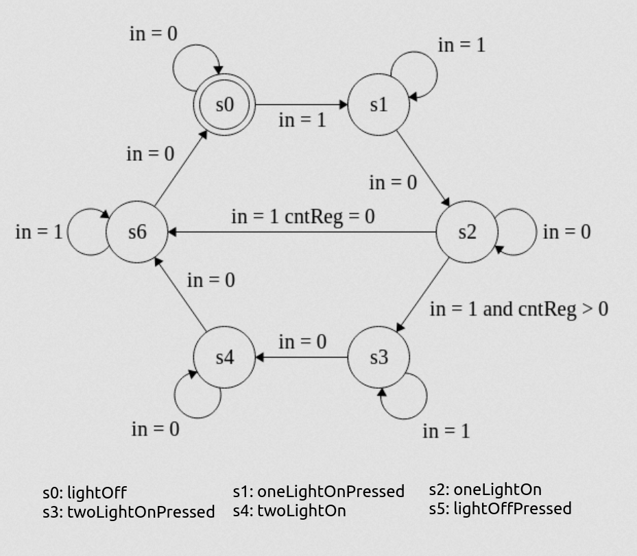

# Introduction to Finite State Machines (FSM) in Chisel
In this notebook you will learn how to describe a finite state machine with data-path. The notebook will introduce you to both Moore and Mealy type FSM with 2 examples. This should enable you to realize two FSMs from a high-level description as exercises to complete this notebook.

# Setting up the environment
First, we run the following line to set up the environment. This is for Scala to download the dependencies for Chisel. This is the same as using a build.sbt file, just set up for these notebooks. This will be the first thing called in the notebooks.

# Turn on one or two LEDs in Moore style
We would like to implement a piece of hardware that can turn on and off two LEDs. If we only used combinatorial logic, one would have to keep the button pressed to have the light on. Needless to say, this would be unpractical for lights in a room. With the power of FSM we can keep the light on without keeping the button pressed. To make the implementation a little more interesting, we would like to enable two light intensities. This will be implemented by having two LEDs turn on by double-tapping the button within 0.5 seconds. To keep track of when 0.5 seconds have passed we are going to use a counter. As Basys3 has a frequency of 100MHz, this means that  $50*10^6$ clock tick will occur in 0.5 seconds. We will initially implement this as a Moore style FSM. Recall that Moore type FSM produces outputs based on the state alone, whereas Mealy type produces output based on the current state and inputs.

The simple light switch FSM follows the FSM diagram below:



As an output, we want both LEDs to be off when in state *lightOffPressed* and *lightOff*.  
We want one LED to be on in state *oneLightOnPressed* and *oneLightOn*.
We want two LEDs to be on in state *twoLightOnPressed* and *twoLightOn*.

This is implemented in the class SimpleMoore below. Inspect and understand this code. **We encourage you to instantiate and connect this module in FSMTop (found last in this notebook), generate the Verilog code and implement it on your Basys3 board. IS NOT SET UP FOR NON NOTEBOOK VERSION YET**

```scala
class SimpleMoore() extends Module {
    val io = IO(new Bundle{
        val in   = Input(Bool())
        val out  = Output(UInt(2.W))
    })
    
    // Here we declare the states in our ASM
    val lightOffPressed :: lightOff :: oneLightOnPressed :: oneLightOn ::  twoLightOnPressed :: twoLightOn :: Nil = Enum(6)

    // Here we declare the state register
    val stateReg = RegInit(lightOff)

    // Declaring 0.5 second counter register
    val cntReg = RegInit(50000000.U) // the width is implied from the initialization value
    
    //Here we describe the next state logic
    switch (stateReg) {
        is (lightOff) {
            when(io.in) {
                stateReg := oneLightOnPressed
            }
        }
        is (oneLightOnPressed) {
            when(~io.in){
                stateReg := oneLightOn
            }
        }
        is (oneLightOn) {
            when(io.in && cntReg > 0.U) {
                stateReg := twoLightOnPressed
            }.elsewhen(io.in) {
                stateReg := lightOffPressed 
            }
        }
        is (twoLightOnPressed) {
            when(~io.in){
                stateReg := twoLightOn
            }
        }
        is (twoLightOn){
            when(io.in){
                stateReg := lightOffPressed
            }
        }
        is (lightOffPressed) {
            when(~io.in) {
                stateReg := lightOff
            }
        }
    }
    
    io.out := "b01".U // default value
    // Here we describe the datapath
    switch (stateReg) {
        is (lightOff) {
            io.out := "b00".U
            cntReg := 50000000.U //reset counter
        }
        is (oneLightOnPressed) { 
            io.out := "b01".U // One LED on
        }
        is (oneLightOn) {
            io.out := "b01".U 
            when(cntReg != 0.U){ // count down until we reach 0
                cntReg := cntReg - 1.U
            }
        }
        is (twoLightOnPressed) {
            io.out := "b11".U //Two LEDs on
        }
        is (twoLightOn){ 
            io.out := "b11".U
        }
        is (lightOffPressed) { 
            io.out := "b00".U // No LED on
        }
    }
    
}
```
# Mealy style
To remind you off the difference between Moore and Mealy style FSM, we have implemented the same function as a Mealy style FSM below. Inspect the code and draw the equivilent FSM chart for the Mealy version implemented below.

```scala
class SimpleMealy() extends Module {
    val io = IO(new Bundle{
        val in   = Input(Bool())
        val out  = Output(UInt(2.W))
    })
    
    // Here we declare the states in our ASM
    val lightOffPressed :: lightOff :: oneLightOnPressed :: oneLightOn ::  twoLightOnPressed :: twoLightOn :: Nil = Enum(6)
    // Here we declare the state register
    val stateReg = RegInit(lightOff)
    // Declaring 0.5 second counter register
    val cntReg = RegInit(50000000.U) // the width is implied from the initialization value
    
    //Here we describe the next state logic
    switch (stateReg) {
        is (lightOff) {
            when(io.in) {
                stateReg := oneLightOnPressed
            }
        }
        is (oneLightOnPressed) {
            when(~io.in){
                stateReg := oneLightOn
            }
        }
        is (oneLightOn) {
            when(io.in && cntReg > 0.U) {
                stateReg := twoLightOnPressed
            }.elsewhen(io.in) {
                stateReg := lightOffPressed 
            }
        }
        is (twoLightOnPressed) {
            when(~io.in){
                stateReg := twoLightOn
            }
        }
        is (twoLightOn){
            when(io.in){
                stateReg := lightOffPressed
            }
        }
        is (lightOffPressed) {
            when(~io.in) {
                stateReg := lightOff
            }
        }
    }
    
    io.out := "b01".U // default value
    // Here we describe the datapath
    switch (stateReg) {
        is (lightOff) {
            when(io.in){
                io.out := "b01".U //Mealy output
            }.otherwise{
                io.out := "b00".U
            }
            cntReg := 50000000.U //reset counter
        }
        is (oneLightOnPressed) {
            io.out := "b01".U
        }
        is (oneLightOn) {
            when(io.in && cntReg > 0.U){
                io.out := "b11".U //Mealy output
            }.elsewhen(io.in){
                io.out := "b00".U //Mealy output
            }.otherwise{
                io.out := "b01".U
            }
            when(cntReg != 0.U){ // count down until we reach 0
                cntReg := cntReg - 1.U
            }
        }
        is (twoLightOnPressed) {
            io.out := "b11".U
        }
        is (twoLightOn){ 
            when(io.in){
                io.out := "b00".U //Mealy output
            }.otherwise{
                io.out := "b11".U
            }
        }
        is (lightOffPressed) { 
            io.out := "b00".U
        }
    }
    
}
```

# Your turn!
You should now understand how to implement an FSM in Chisel3. Now, lets put your understanding to the test.

## Excercise 1: 
In this exercise, you will be given a formal description of a system that must be implemented using an FSM. Your task is to design a FSM that can realize this system. This includes:
- Determine the state that is needed to implement the system
- Describe what operations that must be performed in each state
- Draw a FSM chart for the system
- Implement the FSM in a Chisel class
- Instantiate the written class as a module in FSMTop, in order to generate the Verilog code and implement it on the Basys3 FPGA

### System Description:
You are to design a system that has 3 inputs being *up, down* and *zero*. These inputs are supplied by the pushbuttons BTNU (T18), BTND (U17) and BTNR (U17) respectively from the Basys3 board. The system should as output have a 4-bit unsigned integer signal *out_num*. The bit vector of *out_num* should be displayed with the 4 lowest of the 16 LEDs on the Basys3 board (*LD3 - LD0*). As an initial condition *out_num* = 0000. The system must be able to perform the following operations.

- When *up* is pushed *out_num* must be increased by 1
- When *down* is pushed *out_num* must be decreased by 1
- When *zero* is pushed *out_num* must be set to 0 (0000)

Initially, the system may allow for over- and underflow of "*out_num*". This means that 15 + 1 = 0 and 0 - 1 = 15

Implement the system in template class UpDownFSM1 in the file src/main/scala/FSMEx1.scala. Afterwards instantiate and connect the module in the class FSMTop1 in the same file. (Hint: consider using Mealy type for a simpler FSM)

You can generate the verilog code by running following command:

    $ sbt "runMain exercises.FSMTop1Driver"

Implement and test on the Basys3 board.

## Excercise 2: 
You should now extend your FSM to prevent over- and underflow. If an input leads to over- or underflow the system should enter an error state. When the system is in the error state the top LED (*LD15*) should be lit. The system should exit the error state only when *zero* is pushed. 

Follow the same steps as in exercise 1 and implement the FSM in template class UpDownFSM2 in the file src/main/scala/FSMEx2.scala:

You can generate the verilog code by running following command:

    $ sbt "runMain exercises.FSMTop2Driver"

Implement and test on the Basys3 board.