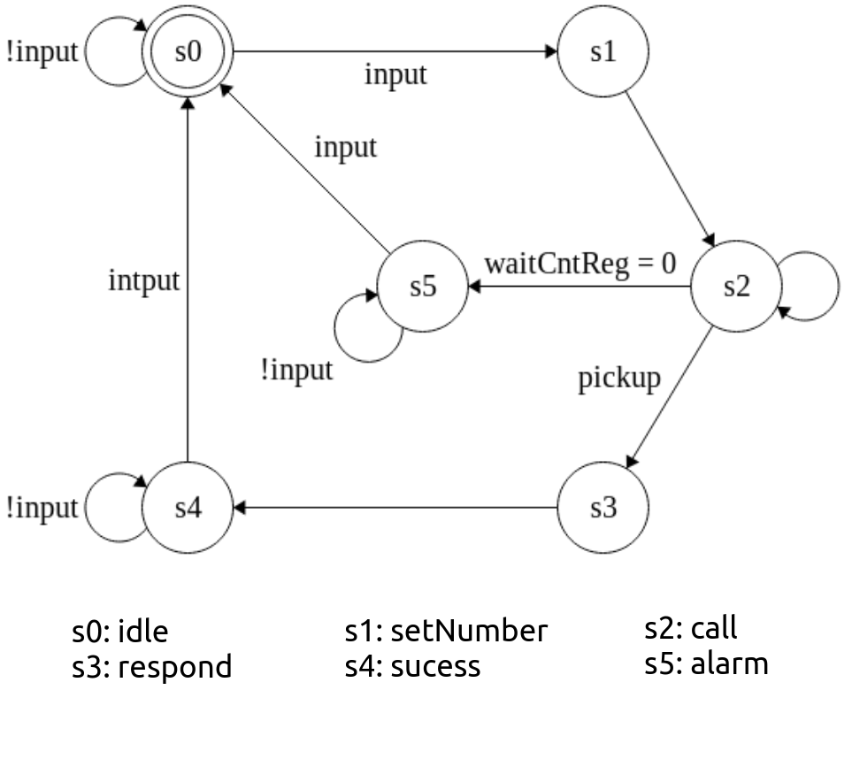
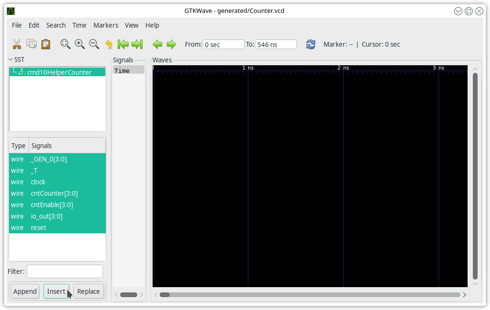

# Testing using waveforms

In this notebook, you will see how to use the PeekPokeTester and the most powerful tool for debugging hardware; the waveform. When runnning the PeekPokeTester, we can either inspect the outputs which we peek, but this does not tell us a lot about what is actually happenning. Therefore, it is also possible to output a VCD (Value Change Dump) file, which contains the waveform for the generated hardware signals. This allows us to find exactly which signal is behaving wrong and we can then backtrack to find the source of the problem.

## Setup Chisel

```scala
import chisel3._
import chisel3.util._
import chisel3.iotesters.{ChiselFlatSpec, Driver, PeekPokeTester}
```

# Late night at DTU? Order a pizza!
You're behind on your assignment. You have decided to take a late night at DTU to get on top of things. As its starting to get late you start to feel hungry. You decide to order a Pizza. As you see no end on your assignment you don't want to spend time ordering the pizza. Luckily your friend has written a Chisel code that describes a piece of hardware that can order your favourite pizza with only one press of a button. After having pressed the button and waited an hour without any pizza being delivered, you figure that there must be a bug in his hardware. To show your friend your superior hardware and Chisel knowledge you decide to fix his code. As documentation your friend has provided a FSM diagram, and the following description of the logic in each state.

idle: reset the wait counter to 15 (is set low for its purpose to make the looking at the waveform less tedious).  
setNumber: sets the phone number to be called.  
call: decrement counter until 0 is reached.  
respond: start prerecorded ordering message.  
success: turn on success LED indicator.  
alert: turn on alarm LED indicator.  



Below the source code is given. To debug the code you need to take a look a the waveforms that the hardware generates. First step to run the code below. Afterwards we will run a test sequence using chisels peek-poke-tester. Peek-poke-tester can generate a .vcd file with the wavefroms produced from the test sequence. This is done in the last code block.


```scala
class PizzaOrdering() extends Module {
    val io = IO(new Bundle {
        val input      = Input(Bool())
        val pickUp     = Input(Bool())
        
        val startMsg   = Output(Bool())
        val succesLED  = Output(Bool())
        val alarmLED   = Output(Bool())
    })
    
    val idle :: setNumber :: call :: respond :: success :: alarm :: Nil = Enum(6)
    
    val stateReg = RegInit(idle)
    
    val waitCntReg = RegInit(15.U)
    
    val number = Wire(UInt(32.W))
    
    
    
    switch(stateReg){
        is (idle) {
            when(io.input){
                stateReg := setNumber
            }
        }
        is (setNumber) {
            stateReg := call
        }
        is (call) {
            when(io.pickUp){
                stateReg := respond
            }.elsewhen (waitCntReg === 0.U){
                stateReg := success
            }
            
        }
        is (respond) {
            stateReg := success
        }
        is (success) {
            when(io.input){
                stateReg := idle
            }
        }
        is (alarm) {
            when(io.input){
                stateReg := idle
            }
        }
    }
    
    number       := 0.U
    io.startMsg  := false.B
    io.succesLED := false.B
    io.alarmLED  := false.B
    
    switch(stateReg){
        is (idle) {
            waitCntReg := 15.U
        }
        is (setNumber) {
            number := Cat(4.U(4.W), 5.U(4.W), 8.U(4.W), 7.U(4.W), 0.U(4.W), 6.U(4.W), 1.U(4.W), 6.U(4.W))
        }
        is (call) {
            when(waitCntReg != 0.U){
                waitCntReg := waitCntReg - 1.U
            }
        }
        is (respond) {
            io.startMsg := true.B
        }
        is (success){
            io.succesLED := true.B
        }
        is (alarm){
            io.alarmLED := true.B
        }
    }
}
```

## Generating a VCD file
In the code below we will generate the waveform to a .vcd file. Which we can inspect in GTKWave.

Run the following command to generate the output:

    $ sbt "runMain testingUsingWaveforms"

When calling the PeekPokeTester, we include three arguments:

* "--generate-vcd-output","on"
    * Tells the backend to generate a VCD file.
* "-tn", "Pizza"
    * TopName, tells the name of the top module.
    * This is only used because we run in Jupyter Notebook, which would otherwise give a mangled name.
* "-target-dir", "generated"
    * Choose the folder/directory to save the output in.


```scala
val testResult = Driver.execute(Array("--generate-vcd-output","on", "-tn", "Pizza","--target-dir", "generated"),() => new PizzaOrdering()) {
  c => new PeekPokeTester(c) {
    step(3) //Move 50 clock cycle ahead.
    poke(c.io.input, true)
    step(1)
    poke(c.io.input, false.B)
    step(20)
    poke(c.io.pickUp, true.B)
    step(1)
    poke(c.io.pickUp, false.B)
    step(15)
  }
}
```

# Verifying with GTKWave
We can now look into the *generated* folder, which contains the Pizza.vcd file. This has the waveforms and can be opened in a program like GTKWave. Open the file using GTKWave and verify the result.

## Check the Waveform

To show a waveform:
- Open gtkwave
- Click **file -> Open New Tab**
- Navigate to the generated folder and open Pizza.vcd
- choose the module on the left side, mark the signals you want to look at and click insert.

You now have a set of signals you can look into. You're task is to find the bug and correct the PizzaOrdering() class.




