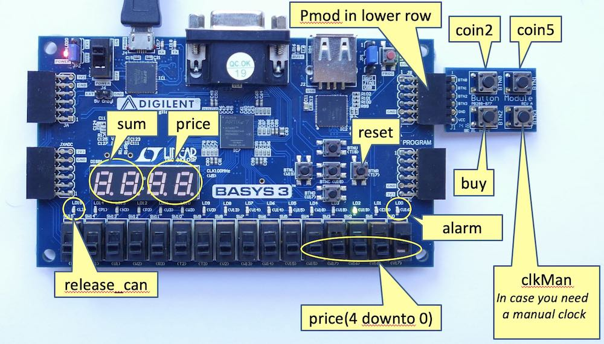

# The Vending Machine


The inputting of coins (2 kr. and 5 kr.) is emulated by two push-buttons
```coin2``` and ```coin5```. The price of an item, called ```price```,
is set by five switches, and two digits in the display shall show the ```price```.
The left two digits in the display show the ```sum``` of the money entered so far.
After entering enough money, a customer may press a button ```buy``` and this
will result in the controller asserting the ```releaseCan``` output signal.
If too little money is entered when ```buy``` is pushed an output ```alarm```
will be asserted instead. The ports ```alarm``` and ```releaseCan``` are
connected to two LEDs on the FPGA board.

This folder contains the setup of the full Vending Machine project.
It includes a top-level of the design (```VendingMachine```), the
constraint file ```vedning.xdc``` for the pin definitions,
a start for a test (```VendingTester```), and a simulation of the Basys 3
board (```VendingSimulation```).



## Vending Machine Specification

The vending machine sells one type of canned soft drink.
The price of a can is set by the owner of the machine using 5 switches.
Using unsigned binary representation this allows a price range from 0 kr. to 31 kr.
The price is displayed on two seven-segment displays in hexadecimal representation.
The other two seven-segment displays show the amount of money entered so far.


The machine accepts two types of coins: 2 kroner and 5 kroner.
The inputting of coins is emulated by two push-buttons called ```coin2```
and ```coin5```. The amount entered so far (called ```sum```) is displayed
on the left two seven-segment displays using hexadecimal representation.
When enough money has been entered, the customer may press a button ```buy```.
In response the machine will activate a signal ```releaseCan``` for as long as
```buy``` is pressed and subtract the ```price``` of a can from the ```sum```.
The machine does not return any money; any surplus is left for the next purchase.
If ```buy``` is pressed before enough money has been entered the machine activates
a signal ```alarm``` for as long as ```buy``` is pressed.

We will make the following simplifying assumptions: 

 1. The vending machine never runs out of cans. 
 2. Only one of the signals ```buy```, ```coin2```, and ```coin5``` are asserted at any given time. 
 3. The user never enters  more money than what the machine can represent and display.

After turning on power the owner resets the machine. Asserting ```reset``` is an
indication that the machine is full of cans and that all coin compartments have
been emptied. In addition, ```reset``` sets ```sum``` to 00.

Important note: It is important that input signals that cause actions when they
are asserted are implemented by push buttons that are de-bounced.
The Basys 3 board has only 4 de-bounced push-buttons on the extension board.
We will use these for the input signals ```buy```, ```coin2```, and ```coin5```.
For ```reset``` a bouncing button is sufficient, as long as the reset signal is
synchronized. The bounce produced by the switch may cause reset to be asserted
and de-asserted multiple times, but it is OK to reset a circuit multiple times.

Later, when you have completed the laboratory exercises according to
the above specifications and demonstrated your design to a teaching assistant,
you may want to extend your design. Below is a list of ideas.
You may have more ideas.
Please explain and include any optional design work in your report.

 * Supplement the alarm by visual signal, for example blinking the sum display.
 * Count coins and assert alarm if a coin compartment is full (>20 of given type ).
 * Maximum number of cans in the machine; for example 20. If the machine gets empty show ```EPty``` in the four seven-segment displays.
 * Implement a digital debouncer circuit. This will allow you to use the push buttons on the Basys 3 board itself (instead of the external Pmod BTN push-button module).
 * Connect a [UART](https://github.com/schoeberl/chisel-book/blob/master/src/main/scala/uart/uart.scala) to your VM and sending messages to your laptop.
 * ... your ideas

The *standard solution* without any optional tasks is considered a
*standard performance*. To obtain a top grade (i.e., 10 or 12)
you are expected to develop additional features.

## Design and Implementation

The first step is to design a datapath. To do this you need to determine what data
you need to store and manipulate. This defines the registers in the datapath.
By data we mean variables and not constants. Constants in hardware is just a
matter of connecting signals to Vdd and Ground. Then you determine what operations
you need to perform on the data.
An operation is performed during a clock cycle and some example operations are
```nextVal := sum + 5``` or ```nextVal := sum - price```.
List all the operations that your datapath should be capable of performing.
Based on this list of clock-cycle operations and the list of registers you
should be able to design a datapath. There is a lot of freedom and many alternatives.
In our case it should suffice to be able to do one single arithmetic operation
in a clock cycle, i.e., to use only one single adder/subtractor in the datapath.
When the datapath is in place, the next step is to design the finite state machine (FSM)
that will control the sequence of operations in the datapath and deliver the
output signals ```releaseCan``` and ```alarm```. This combination of a datapath
with and FSM is called a state machine with datapath (FSMD).

In summary the design phase involves the following:

 * A list of registers and *clock cycle operations* to be supported by the datapath.
 * A diagram showing an intended datapath design (registers, multiplexers, adders/subtractors etc.)
 * A complete specification of the central processing unit in the form of a state graph for the FSM.
 * A test sequence for simulating your design, i.e., a timing diagram showing the input signals that you want your Chisel test-bench to generate along with the expected outputs from your circuit.


A comment about the input signals:
You should be aware of the fact that the signals will be asserted for as many clock
cycles as you push the buttons and switches. For ```reset``` and ```buy``` this is
what you want and need to deal with. For signals ```coin2``` and ```coin5```
you do not want to add 2 kr. or 5 kr. for as many cycles a you push the corresponding
button. To avoid this the FSM in your vedning machine must respond to the rising edge
and wait for the corresponding signal to be de-asserted.
Alternatively you may want to improve the input synchronizer such that it delivers
signals ```coin2``` and ```coin5``` that are active for one clock cycle only.

### Implementation
The next step is to describe the design of your vending machine in Chisel.
We recommend that you describe your design as one component (Chisel Module).
As errors are very hard to identify on the FPGA board we recommend that you
simulate your design.

 * Write the Chisel code according to these guidelines.
 * Write a Chisel test-bench that can drive the simulation and simulate your circuit.

Now synthesize and upload the design to your Basys 3 FPGA-board.
Enjoy a job well done! **Show your working design to a TA.**


### Evaluation

Assess the resource usage for the ```VendingMachine```.
Synthesize it separately and check the resource usage reported by Xilinx Vivado.
How many LUT's and FF's are used? Compare the RTL schematics with your hand designed
datapath.

## Testing the Design

When writing your code, always run tests. Best approach is a test-driven development
where you write tests together with the design. This repository contains a simple
test to get you started. It presses some buttons and generates a waveform file that
you can view with GTKWave (remember to open a ```.vcd``` file with ```File - Open New Tab```).
You can run the test with:

```
sbt test
```

Extend the test with your own tests.


## Generating the Verilog Files for the FPGA

Finally, the real test is in the FPGA baord. Generate the Verilog file with:

```
sbt run
```

Create a Xilinx Vivado project with the generatd Verilog file
```VendingMachine.v``` and the constraint file ```vending.xdc```.


## Simulating the Basys3 Board

Furthermore, we can also run the vending machine hardware with a simulation
of the Basys3 board, as follows:

```
sbt test:run
```

The simulation contains the 7-segment  display simulation that is included
in lab8. As with the waveform tester, switch the display at a higher
frequency (e.g., every 20 clock cycles) to avoid simulating forever.

The simulation contains three buttons for the VM that are connected to
the inputs ```con2```, ```con5```, and ```buy```. With one click you can
toggle to pressed, with another clock you can toggle back to release.
The status is also written out to the command line.

The ```Exit``` button stops the simulation.

The next row simulates the 16 green LEDs. Two LEDs are connected to
```releaseCan``` and ```alarm```.

The bottom row contains 16 check boxes to simulate the 16 switches.
The right 5 check boxes are connected to the ```price``` input.

## Guidelines for the Report

According to the course description your performance in the course is based on
"Written examination and reports". There is only one report.
A report covering the entire vending machine project.
Below you find some requirements and guidelines for the report.
You may write your report in Danish or in English if you want to practice this.

The report must be handed in using DTU Learn, where you find an assignment called
"Vending Machine Project". One student from each team should upload the report
and the other team members should ``join''.
As the report is considered part of the exam it is important that we have
everybody registered. The file must be in PDF-format and the report including
all appendices (Chisel code listings, etc.) must be in a *single file*.
This is important! We do not accept MS Word and we do not accept multiple files.
The file must be named group<group number>.pdf (for example: group10.pdf).

DTU Learn performs a check for plagiarism, and we assume that you are
aware of DTU's policy on this (see: Studiehaandbog, Regelsamling, afsnit 3.9
"Snyd ved eksamen og anden bedoemmelse").

**If you want, you are allowed to use the help of ChatGPT to write your report.**
In that case, state in the preface that you used ChatGPT to write/enhance the
report and cite ChatGPT. You ae still responsible for the text and any
nonsense that ChatGPT writes.

**If you want, you are allowed to use the help of ChatGPT and/or Copilot
to help you in Chisel coding.**
In that case, have a section on reflecting how helpful those tools were
and what you learned from using them. Cite the tools.
You are still responsible for the  code and any nonsense that ChatGPT
or Copilot writes.

**If you use ChatGPT, Copilot, or any AI as help, write an extra section
reflecting on the experience.** What did you learn? What did you not learn?

The cover page of the report must contain the following information:

 1. Number and name of the course:  02139: Digital Electronics 2. (Danish: "02139 Digital elektronik 2").
 2. Title of the report:  Vending Machine Project.   (Danish: "Sodavandsautomat projekt").
 3. Name, student id number, and a passport size photo of each team member.


The rest of the documents contains:

 1. Preface (Danish: Forord): A clear indication of the contributions of each team member; sufficiently detailed to enable an assessment of the contribution of each individual student. Information about issues that have influenced the work, for example change of group members. 
 2. The body of the report should cover the preparation and the lab work for laboratory exercises. 
 3. As a guideline the report should be about 10 pages of text, excluding figures and appendices. Include appendices with Chisel code (only files you have written or modified) and screen-dumps of the wave-window to document your simulations.
 4. Have block diagram figures for your design.
 5. A state diagram for your FSM.
 6. A schematics of your datapath.
 7. All figures need to be drawn ``nicely''; that means with a drawing program and not hand drawn and a picture taken. 
 
### A generic report structure may be as the following:

Abstract. (Summary and achievements/results)

Preface. (Who did what etc.)

1. Introduction and Problem Formulation (Welcoming the reader. Setting the scene)
2. Analysis and Design (Figuring out what to build)
3. Implementation (Building it)
4. Test (how was it tested)
5. Results  (Objective figures and facts)
6. Discussions (Your reflections)
7. Experiences Using AI Tools (if used, reflections on usage of ChatGPT, Copilot, etc.)
8. Conclusion (Summary and goodbye)
9. List of References

Appendix A: Chisel code for the design

Appendix B: Chisel code for test-benches

Appendix C: ??


A report is not a lab notebook, nor a set of problem solutions.
A report is a stand-alone document that is written after all the work
has been performed. However, it is good practice to take notes in electronic form during your work for a collection of facts. When writing the report, remember that the aim is to explain to an outsider and in the most efficient way possible what has been done, how it has been done, and the conclusions that can be drawn from the work. Be brief, and make sure the reader knows where you are heading. The report should present the material in a logical order, which is sometimes different from the order in which the tasks were performed.

Finally, a word about copyright: You are *not* allowed to silently copy figures
or text from other documents! In general the rules are as follows:

You are allowed to reuse short passages of text provided that you clearly state this. In the running text you can do this by writing:
... as stated/explained in [ref]: *"the text that you are copying"* ...  where [ref] is a complete and correct citation of the document from where you are copying the text.

Figures are generally covered by copyright and can only be used if you obtain
permission from the copyright holder.
